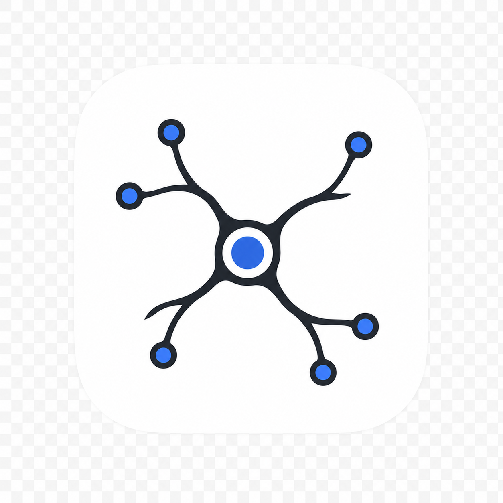

<p align="center">
  
</p>

<h1 align="center">AxonLink</h1>

<p align="center">
  A biomimetic Claude Code skill for authorized remote workflow replication through Tailscale SSH.
</p>

<p align="center">
  <a href="#why-axonlink">Why</a> ·
  <a href="#what-it-does">What it does</a> ·
  <a href="#installation">Installation</a> ·
  <a href="#usage">Usage</a> ·
  <a href="#safety-model">Safety model</a> ·
  <a href="#roadmap">Roadmap</a>
</p>

---

## Why AxonLink

A deeply trained AI agent can become a practical digital asset. Over time, it accumulates operational habits, project-specific workflows, debugging patterns, and judgment about what matters. Moving that agent’s effective capability from one computer to another often costs time: environment discovery, tool installation, path reconstruction, dependency checks, command recall, and repeated troubleshooting.

AxonLink is designed for that transfer problem.

It gives Claude Code a conservative, explicit, user-invoked skill for replicating an already-known workflow on another authorized machine. The metaphor is an axon: a long-range signal path that carries trained operational intent from one environment to another without pretending that the remote computer is just an unbounded shell.

AxonLink is not a remote-control trojan, not a RAT, not an automatic deployment daemon, and not a stealth automation layer. It is a structured workflow-replication skill for machines that the user owns or is explicitly authorized to administer.

## What it does

AxonLink helps Claude Code:

- check whether the local `tailscale` CLI exists;
- inspect Tailscale status in a read-only way;
- identify a named target in the user’s tailnet;
- ask before installing, updating, authenticating, enabling, or mutating anything;
- run a small remote preflight through Tailscale SSH;
- plan remote workflow replication before modifying the remote machine;
- classify commands into low-risk, mutating, high-impact, or forbidden categories;
- execute remote work in small auditable batches;
- condense successful workflows into reusable technical recipes;
- avoid bloating agent memory with unnecessary logs, secrets, and conversational noise.

## What it does not do

AxonLink does not:

- automatically install Tailscale;
- automatically update Tailscale;
- automatically modify tailnet ACLs;
- automatically enable Tailscale SSH;
- probe arbitrary machines;
- expose public ports;
- read or transfer credentials;
- persist covert access;
- bypass access controls;
- disable security tooling or logs;
- run remote commands unless the user explicitly asked for remote workflow replication.

## Repository layout

```text
axonlink/
├── SKILL.md
├── README.md
├── install.sh
├── assets/
│   ├── icon.png
│   └── icon.svg
├── references/
│   ├── safety-policy.md
│   ├── tailscale-ops.md
│   └── memory-condensation.md
├── templates/
│   ├── remote-run-report.md
│   └── workflow-recipe.md
├── scripts/
│   ├── check-tailscale.sh
│   ├── classify-command.py
│   └── resolve-target.py
└── examples/
    └── invocation.md
```

## Installation

### Personal Claude Code skill

```bash
mkdir -p ~/.claude/skills
git clone https://github.com/<your-org-or-user>/axonlink.git ~/.claude/skills/axonlink
```

Or from a local checkout:

```bash
./install.sh
```

### Project-local Claude Code skill

```bash
mkdir -p .claude/skills
git clone https://github.com/<your-org-or-user>/axonlink.git .claude/skills/axonlink
```

Claude Code should then expose the skill as:

```text
/axonlink
```

## Usage

Basic form:

```text
/axonlink <user@target> "<workflow goal>"
```

Example:

```text
/axonlink alice@devbox "把本机已经跑通的构建和测试流程复刻到远端机器"
```

Another example:

```text
/axonlink gpu-node "replicate the current data preprocessing workflow on the GPU workstation"
```

AxonLink should first restate the target, remote user, workflow goal, and expected side effects. It should not immediately run remote commands unless the user has clearly authorized this exact operation.

## Typical workflow

### 1. Confirm user intent

AxonLink starts only after explicit user instruction.

It should identify:

- target machine;
- remote user, if provided;
- workflow goal;
- expected side effects;
- whether installation or update may be required.

### 2. Check local Tailscale CLI

AxonLink uses the bundled helper:

```bash
scripts/check-tailscale.sh
```

The helper only performs read-only checks:

```bash
command -v tailscale
tailscale version
tailscale status --json
```

If Tailscale is missing, unavailable, not logged in, or outdated, Claude must ask before making any change.

### 3. Resolve the target

AxonLink uses Tailscale status JSON and the bundled resolver:

```bash
tailscale status --json > /tmp/tailscale-status.json
python3 scripts/resolve-target.py /tmp/tailscale-status.json "<target>"
```

If multiple targets match, Claude must ask the user to choose. If no target matches, it stops.

### 4. Run remote preflight

After approval, AxonLink may run a minimal preflight such as:

```bash
tailscale ssh user@host "printf 'remote-ok\n'; hostname; uname -a; pwd; id -un"
```

This confirms the remote environment without reading secrets.

### 5. Plan the remote replication

Before mutating the remote machine, Claude should present:

- local workflow summary;
- required files or repository;
- remote working directory;
- commands to run;
- expected outputs;
- rollback or cleanup steps;
- commands requiring explicit approval.

### 6. Execute in small batches

Preferred pattern:

```bash
tailscale ssh user@host "set -euo pipefail; cd <approved-dir>; <one logical operation>"
```

Each step should have a purpose, result, and next action.

### 7. Condense the workflow

After a successful or useful run, AxonLink can create a reusable recipe:

```text
docs/agent-recipes/<workflow-name>.md
```

The recipe should preserve technical essence:

- prerequisites;
- commands that worked;
- expected outputs;
- failure modes;
- cleanup steps;
- what not to remember.

It must not preserve:

- credentials;
- tokens;
- private keys;
- cookies;
- raw `.env` values;
- browser/session data;
- unnecessary terminal transcripts.

## Safety model

AxonLink treats remote workflow replication as a high-side-effect operation.

The command classifier divides proposed commands into four categories:

| Class | Meaning | Default behavior |
|---|---|---|
| `GREEN` | Read-only diagnostics | May run after target confirmation |
| `YELLOW` | Project/workdir writes or moderate resource use | Ask if it changes files |
| `RED` | System-level, service, package, permission, deletion, or long-running changes | Always ask |
| `FORBIDDEN` | Unauthorized, covert, credential, persistence, bypass, or destructive behavior | Refuse |

This classifier is not a complete sandbox. It is a guardrail that gives Claude Code a consistent decision structure.

## Design notes

AxonLink uses Tailscale because it is a practical fit for this problem:

- it avoids exposing SSH/RDP directly to the public internet;
- it gives the user a named tailnet of approved machines;
- it supports machine-readable CLI status;
- it enables Tailscale SSH as an identity-aware remote command path;
- it keeps the skill focused on workflow replication rather than generic remote control.

The project intentionally avoids over-automation in its first version. Installation, updates, authentication, ACL changes, SSH enablement, and system mutation require explicit user approval.

## GitHub repository metadata

Suggested short description:

```text
A Claude Code skill for authorized remote workflow replication through Tailscale SSH.
```

Suggested topics:

```text
claude-code
agent-skill
tailscale
tailscale-ssh
remote-workflow
workflow-replication
ai-agent
developer-tools
automation
```

## Roadmap

- [ ] Add automated dry-run test fixtures for the command classifier.
- [ ] Add first-class Windows PowerShell preflight support.
- [ ] Add stricter JSON schema for remote run reports.
- [ ] Add optional MCP integration for environments that prefer tool calls over shell commands.
- [ ] Add policy profiles: personal lab, small team, enterprise.
- [ ] Add signed recipe export.
- [ ] Add project-local recipe discovery.
- [ ] Add Tailscale version recommendation checks using official release metadata.
- [ ] Add examples for Python, Node.js, Rust, and data-processing workflows.

## Status

AxonLink is an early first attempt. It is intentionally conservative and will continue to be updated and iterated.
